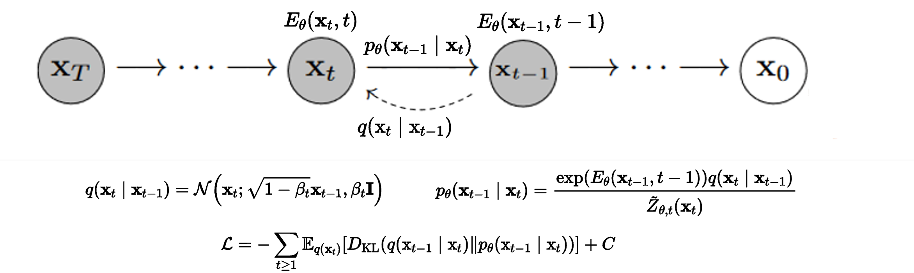

# Improving Adversarial Energy-Based Model via Diffusion Process
Pytorch implementation of the paper [Improving Adversarial Energy-Based Model via Diffusion Process](https://arxiv.org/pdf/2403.01666)

by [Cong Geng](https://gengcong940126.github.io), [Tian Han](https://thanacademic.github.io), [Peng-Tao Jiang](https://pengtaojiang.github.io), Hao Zhang, Jinwei Chen, [Søren Hauberg](https://www2.compute.dtu.dk/~sohau), and [Bo Li](https://libraboli.github.io).

---

*Abstract:* Generative models have shown strong generation ability while efficient likelihood estimation is less explored. Energy-based models (EBMs) define a flexible energy function to parameterize unnormalized densities efficiently but are notorious for
being difficult to train. Adversarial EBMs introduce a generator to form a minimax training game to avoid expensive MCMC sampling used in traditional EBMs, but a noticeable gap between adversarial EBMs and other strong generative models
still exists. Inspired by diffusion-based models, we embedded EBMs into each denoising step to split a long-generated process into several smaller steps. Besides, we employ a symmetric Jeffrey divergence
and introduce a variational posterior distribution for the generator’s training to address the main challenges that exist in adversarial EBMs. We simply refer to our method as **D**enoising **D**iffusion **A**dversarial **E**nergy-**B**ased **M**odel (**DDAEBM**).


## Requirements
Run the following to install a Python environment:
```
conda env create -f environment.yml
```
This .yml file might be a bit cluttered, but it has been verified to work  across different devices.

## Set up datasets
Following [DDGAN](https://arxiv.org/pdf/2112.07804), for large datasets, we store the data in LMDB datasets for I/O efficiency. Check [here](https://github.com/NVlabs/NVAE#set-up-file-paths-and-data) for information regarding dataset preparation.

## Training DDAEBM

### Toy data
```
python train/train_toy.py
```

### Image data
Image data includes datasets of CIFAR-10 32, CelebA 64, LSUN 128, or your own datasets.
```
python train/train_image.py
```
Code for image datasets is still being prepared and has not been completed with some minor details. Even though, you can still refer to this current implementation. 

## Acknowledgements
- [DDGAN](https://github.com/NVlabs/denoising-diffusion-gan)
- [score_sde](https://github.com/yang-song/score_sde_pytorch)

## BibTeX
```
@article{geng2024improving,
  title={Improving Adversarial Energy-Based Model via Diffusion Process},
  author={Geng, Cong and Han, Tian and Jiang, Peng-Tao and Zhang, Hao and Chen, Jinwei and Hauberg, S{\o}ren and Li, Bo},
  journal={International Conference on Machine Learning},
  year={2024}
}
```
